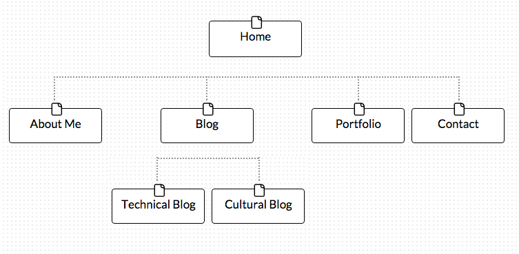

#Site Map Reflection#

###What are the 6 Phases of Web Design?###

The 6 phases of web design are:
1. Information Gathering
    - it is important to understand the purpose, goals, target audience and the content
2. Planning
    - planning via a site map helps you plan your website, main topic areas, and sub topic areas
3. Design
    - look and feel of the website
    - target audience, logo, and design elements like color
    - it is important to create more than one prototype!
4. Development
    - creating the functional site
    - developing a home page followed by a "shell" for interior pages
5. Testing and Delivery
    - finalizing details and testing for complete functionality
    - is the code valid?
    - optimization plug in installations
6. Maintenance
    - updating and maintaining your website is very important if you want to bring repeat visitors

###What is your site's primary goal or purpose? What kind of content will your site feature?###

*My Site Map*

The main purpose for my site is to showcase my blogs and my portfolio to potential employers. My contact page will include links to my social networks, such as twitter, facebook, LinkedIn, Instagram, and GitHub. It will also contain my e-mail address for business inquiries. My website will have a "About Me" page including a background and photo of me. Furthermore, it will have a "Blog" tab to hold all of my technical and personal blogs, as well as a "Portfolio" tab to hold previous projects.

###What is your target audience's interests and how do you see your site addressing them?###

My target audiences are developers who like to read programming blogs or looking to network and employers looking to hire. My site will be easy to navigate and simple for these audiences. I will make it clean and presentable for professionalism whilst adding a hint of personality through the design.

###What is the primary "action" the user should take when coming to your site? Do you want them to search for information, contact you, or see your portfolio? It's ok to have several actions at once, or different actions for different kinds of visitors.###

The primary "action" a potential employer should take would be to first read my background and look through my portfolio and blogs. Then if he or she is interested in interviewing me then they would go to my "Contact" page and retrieve my LinkedIn or email address. If another programmer was visiting my page, he or she would vary in primary actions. He or she might be more interested in reading my blogs or might just want to look at my portfolio.

###What are the main things someone should know about design and user experience? What is user experience design and why is it valuable?###

User experience (UX) is how a person feels when interacting with a system. User experience depends on ease of use, perception, utility, efficiency, and design. UX is important because websites are so complex and feature-rich nowadays that they have to have great UX in order to be effective. It is important to know that the driving factor of website building is the user experience. Web design plays a huge role in UX. As a web designer, you should adjust colors, font types, modular scales, and imagery to evoke certain emotions from your target audience and to carry out the main purpose of your website. There are many ways to deliver content so it is critical to have several protocols!

###Which parts of the challenge did you find tedious?###

This challenge was not bad at all. The readings were informative and interesting since I have never learned about the user experience and truly enjoy web design.

