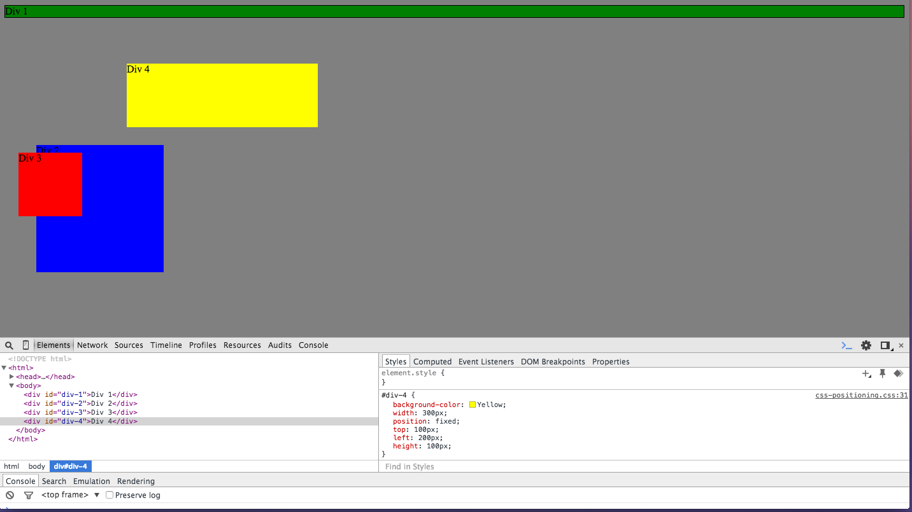
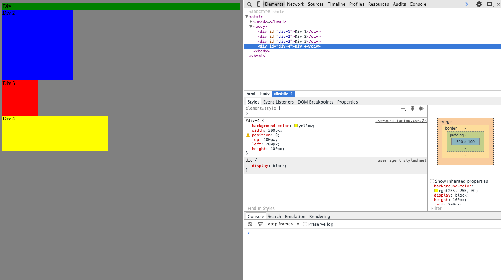
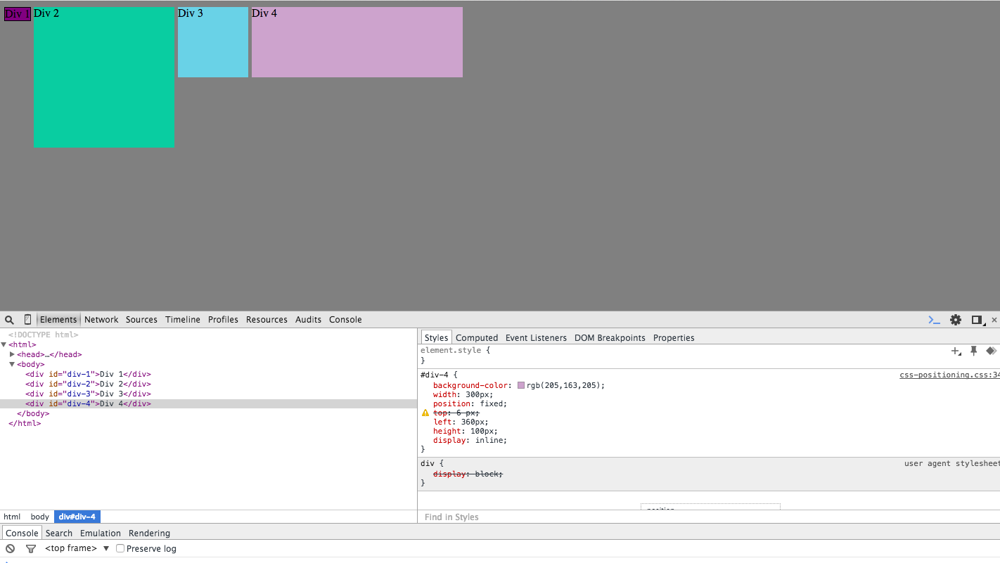

##Screenshots from Release 3##

##My Reflection##

####How can you use Chrome's DevTools inspector to help you format or position elements?####

I think Chrome's DevTools inspector is a great tool for experimenting with formatting. Since it allows you to see the effect of changes right away on the screen, it is useful for testing out incremental adjustments. You can use this tool simply by right clicking onto the screen and click on "Inspect Element." On the CSS code, you can edit selectors and elements to create the colors and layout you want. You can also play around with the margins, positions, and sizes.

####How can you resize elements on the DOM using CSS?####

You can resize elements on the DOM by changing the px, em, or percentage of the width and height selectors of the divs. You can either write the pixels of the width and height you want, or you can even choose a relative size. For instance, making your width 50% would make it the width of half the page.

###What are the differences between Absolute, Fixed, Static, and Relative positioning?###

*Absolute* positioning allows you to place an element wherever you want it and you can adjust the positioning via the top, left, bottom, and right attributes. These attributes are relative to the element's parent or to the page itself depending on if it has a parent or not. *Fixed* positioning allows the element to be positioned relative to the browser window. THe positioning doesn't change even when you scroll up or down the window and will always be in the same place. It can be used to keep the navigation bar present at all times. *Static* positioning is the default for every element. It lets the elements flow into the page. *Relative* positioning places an element relative to its static position. So if you positioned it to move down 10 px, then it will move down 10 px from where it would normally be.

###Which did you find easiest to use? Which was most difficult?###

I found absolute and fixed positioning to be the easiest to use, since they were both straightforward. Relative positioning was more difficult for me, and also things were complicated when you had to position elements relative to one another.

###What are the differences between Margin, Border, and Padding?###

I find an image like very useful for understanding the differences between margin, border, and padding. When you want to place an element in the center of the page, you would be adjusting the margins of it. The margins are the outermost spacing outside the content. So if you put your margin-left and margin-right as "auto" then your element will be placed horizontally in the middle. This means that the left and right margins have automatically adjusted to contain as much space as they can and are occupying the same space.

The padding is the area between the content and the border. If you were to increase the padding of a text box, the space around the text would increase. The border is the border of the element. You can adjust border properties, such as border-color, border-style, and border-width.

###What was your impression of this challenge overall? (love, hate, and why?)###

I found this challenge very tedious, especially because I did not understand the differences between all the types of positionings and was playing around with margins. However, it was a great practice and preparation for when we apply CSS into our websites or future projects. I was able to use this challenge to practice positioning the divs into a blog/website type layout. My partner and I used the 9th part of the Release 3 to try it out.