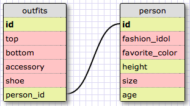

1. SELECT * FROM States;
2. SELECT * FROM regions;
3. SELECT state_name, population
   ...> FROM states;
4. SELECT state_name, population
   ...> FROM states
   ...> ORDER BY population DESC;
5. SELECT state_name
   ...> FROM states
   ...> WHERE region_id = 7;
6. SELECT state_name, population_density
   ...> FROM states
   ...> WHERE population_density > 50
   ...> ORDER BY population_density ASC;
7. SELECT state_name
   ...> FROM states
   ...> WHERE population > 1000000
   ...> AND population < 1500000;
8. SELECT state_name, region_id
   ...> FROM states
   ...> ORDER BY region_id ASC;
9. SELECT region_name
   ...> FROM regions
   ...> WHERE region_name LIKE '%Central%';
10. SELECT regions.region_name, states.state_name
   ...> FROM regions, states
   ...> WHERE states.region_id = regions.id
   ...> ORDER BY region_id ASC;

##Reflection##

###What are databases for?###

Databases are used to store collections of data.
They allow you to store and organize complex data
for easier access and management.

###What is a one-to-many relationship?###

A one-to-many relationship helps to determine whether
to set foreign and primary keys. They help to prevent
repetition in data sets. For instance if you find
yourself using phrases "____ belongs to a ____.
____ has many _____." then you have an opportunity
to separate a table into two.

###What is a primary key? What is a foreign key? How can you determine which is which?###

A primary key is a key in a database that is unique
for each record. It can be thought of as a unique
ID such as a drivers license number. A foreign key
is a field in one table that uniquely identifies
a row of another table.The foreign key refers to the
primary key. For instance, if you have many states
who belonged in the North East. You can create a new
table which has a foreign key of 1 that referes to
North East, then each of those states can have a
primary key of 1 on the first table.

###How can you select information out of a SQL database? What are some general guidelines for that?###

You can select information out of a SQL database
using SQL commands. The basic template is "SELECT
(column(s)) FROM (datatable)." You can select specific
data by adding the "WHERE"command and specifying
where that data is located. EX. WHERE id = 8