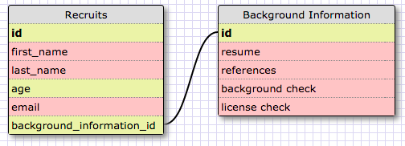
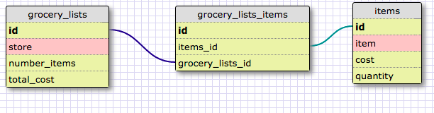

###Release 2###

###Release 4###

###Release 6###

**What is a one-to-one database?**

A one-to-one database has tables which
have a single relationship with one another. The example
brought up by this challenge is a perfect example. A
country and a capital city is a pair and would have a
one-to-one relationship.

**When would you use a one-to-one database? (Think generally, not in terms of the example you created).**

A one-to-one database is used when not all things might have a relationship with the other thing. For example
most people would have an email address, but some
people may not and their email entry would be evaluated
as null. It can also be used for supplemental
information. Usually supplemental information isn't
accessed very often, so you would create a separate
table for that information. This way, data base
performance can also be enhanced.

**What is a many-to-many database?**

A many-to-many database has tables with multiple
relationships. For instance a project can be performed
by multiple students and a student can also perform
multiple projects.

**When would you use a many-to-many database? (Think generally, not in terms of the example you created).**

You would use a many-to-many database for relating
two individual properties. For instance a bank can
have a 100 customers and 2 products (credit card and
checking account). A customer might have one or more
products while a product might be offered to multiple
people.

**What is confusing about database schemas? What makes sense?**
It is sort of confusing to understand the use of
database schemas in actual database structures. The
concept makes sense, but I can see how complicated
database schemas can be in the real world.